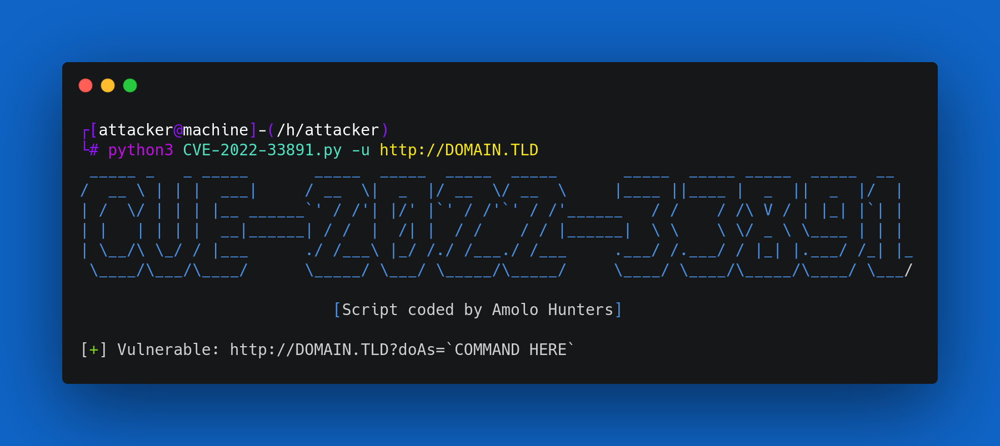

<h1 align="center">「💥」CVE-2022-33891</h1>

<p align="center"></p>

## Description

The Apache Spark UI offers the possibility to enable ACLs via the configuration option spark.acls.enable. With an authentication filter, this checks whether a user has access permissions to view or modify the application. If ACLs are enabled, a code path in HttpSecurityFilter can allow someone to perform impersonation by providing an arbitrary user name. A malicious user might then be able to reach a permission check function that will ultimately build a Unix shell command based on their input, and execute it. This will result in arbitrary shell command execution as the user Spark is currently running as. This affects Apache Spark versions 3.0.3 and earlier, versions 3.1.1 to 3.1.2, and versions 3.2.0 to 3.2.1.

## Demo



## Usage

```
pip install requests
git clone https://github.com/AmoloHT/CVE-2022-33891
cd CVE-2022-33891
python3 CVE-2022-33891.py -u http://TARGET.TLD
```

## Reference

* https://cve.mitre.org/cgi-bin/cvename.cgi?name=CVE-2022-33891
* https://lists.apache.org/thread/p847l3kopoo5bjtmxrcwk21xp6tjxqlc
